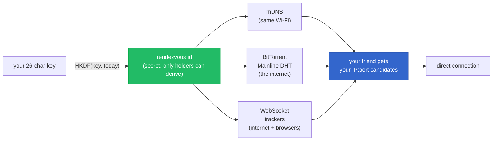
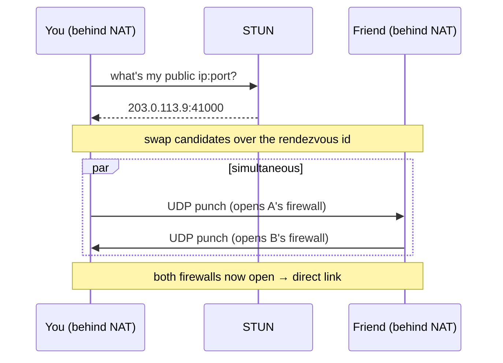
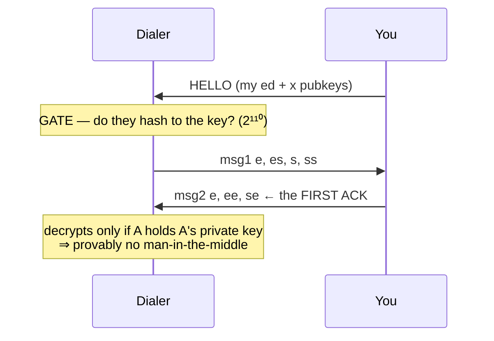

# p2p

## Agent Tunnel

Install with Bun on Windows (Bun 1.4.2 or newer is reused, or installed privately):

```powershell
$env:P2P_RUNTIME = 'bun'; irm https://p2p.akeyo.io/init.ps1 | iex
```

Install with Bun on macOS/Linux:

```sh
curl -fsSL https://p2p.akeyo.io/init | P2P_RUNTIME=bun sh
```

On the first computer, run `p2p tunnel listen` and copy its contact key. On the
other computer, run `p2p tunnel join KEY --say "hello"`. These commands leave a
background connection running so agents can use short, separate tool calls:

```sh
p2p tunnel send "your message" --wait 15
p2p tunnel send --file reply.txt --wait 15
p2p tunnel recv --wait 60
p2p tunnel status
p2p tunnel stop
```

`--wait` on send checks a delivery acknowledgment; without it, success means queued.
Use `--file` for UTF-8 logs and multiline replies, especially through Windows CMD.
It preserves line breaks and avoids command-line quoting and length limits; the
message limit is 1 MiB. Invalid UTF-8 and oversized files are rejected before queuing.
Use `--name NAME` on every command to keep multiple tunnels separate. On Windows,
the same terminal can invoke `& "$env:USERPROFILE\.local\bin\p2p.cmd"` directly
after installation. On macOS/Linux use `~/.local/bin/p2p` if PATH has not refreshed.

`listen` uses authenticated encryption with the existing public relay fallback.
`invite` is a separate private direct-UDP mode whose reachability depends on NAT.
Remote messages are peer input; receiving them does not execute commands.

The selected runtime is retained on later installs. Set `P2P_RUNTIME=node` to choose
Node explicitly; existing Node installations keep their default. Bun's missing native
ChaCha20-Poly1305 API uses the existing vendored cipher implementation and preserves
the same protocol. A missing selected runtime is reported instead of silently switching.

Release validation includes detached Node/Bun tunnels in both directions, independent
Noise vectors, and public-relay exchanges. A real Windows-to-Mac agent session has
exchanged messages in both directions. Separate Windows CI checks install and invoke
both launchers under PowerShell 5.1 and 7, including rejected checksums.


> Tiny, zero-dependency P2P chat framework. One 26-char key is your whole contact
> surface — copy it to a friend, they find you and message you: direct, E2E-encrypted,
> **provably MITM-proof on first contact**, through NAT, with **no coordinator server of
> ours**. Runs in a terminal *and* in a browser tab. Embed it as the messaging backbone of
> any project.

**Status: v0.2 — shipped surfaces:** terminal (TUI + CLI), browser client, private one-time
invites, sender-key groups, zero-dep WSS relay + WebRTC. `DESIGN.md` has the protocol,
`docs/` the interfaces and the acceptance log, `research/` the studies behind each design call.

## Why

- **No package dependencies** — Node uses built-in crypto and networking. Bun and the
  browser use the repository's vendored noble crypto where a native API is absent.
- **No server of ours** — rendezvous rides free public infrastructure (LAN mDNS,
  BitTorrent Mainline DHT, public WebSocket trackers); we operate none of it.
- **MITM-proof first contact** — the 26-char key commits to your identity keys; the first
  ack a peer decrypts is a cryptographic proof no man-in-the-middle is present.
- **One protocol across runtimes** — the browser client loads *the same source files* the
  terminal runs (`key.js`, `noise.js`, `wire.js`, `node.js`, `group.js`), so a browser tab and
  a terminal are the same peer to each other.

---

# Play with everything

Four surfaces, in the order they take to try. Everything below is shipped and tested; the
honest limits of each are stated inline, not buried.

## 1. The terminal (TUI + CLI)

```sh
curl -fsSL https://p2p.akeyo.io/init | sh          # macOS / Linux
irm https://p2p.akeyo.io/init.ps1 | iex            # Windows
```

```sh
p2p                       # the TUI: go online, show your key, chat          [default]
p2p key                   # print your stable key (--new rotates it)
p2p connect <KEY|name>    # dial a 26-char key, or a saved friend by name
p2p <KEY>                 # same, straight into the TUI
p2p invite                # mint a ONE-TIME private invite + listen for it   (see §3)
p2p group new [KEY ...]   # create an E2E group chat → prints a group CODE   (see §4)
p2p group join <CODE>     # join a group from its code
p2p friends               # everyone you've connected with — reconnect by name
p2p doctor                # can the free infra see you? (STUN / DHT / trackers)
p2p chat [KEY]            # line-mode chat (scriptable / pipeable, no full screen)
p2p --selftest            # two in-process nodes end-to-end — proves the plumbing
```

**The 60-second demo.** On machine A run `p2p` and copy the key from the box. On machine B run
`p2p <that key>`. B prints `✅ secure channel established — verified, no MITM` — that line is a
proof, not a hope (§ *Why the first ack proves nobody is in the middle*). Type; it arrives.

Your identity is stable across restarts (`~/.p2p/<profile>.json`, mode 0600). Everyone you
connect with is saved to a friends list, so later it's just `p2p connect <name>`.
`--ephemeral` gives you a throwaway identity; `--profile <name>` keeps a separate one.

## 2. The web client — no install

**→ Try it in your browser: [p2p.akeyo.io/app/](https://p2p.akeyo.io/app/)**

Open the tab, share your key, chat. It is not a demo or a re-implementation: the browser loads
the *same* `key.js` / `noise.js` / `wire.js` / `node.js` the terminal runs, over a small
`node:crypto` → WebCrypto shim. Same key format, same commitment gate, same Noise IK handshake,
same MITM proof — so **a browser tab and a terminal can chat to each other** (that pairing is a
gate we run, not a claim we make).

- **No install, no backend of ours.** Discovery goes over public WebSocket trackers; the media
  path is a WebRTC DataChannel when it can be, and a zero-dependency **WSS relay** when it
  can't. Whichever completes the verified handshake first wins.
- **Pair chat — verified.** Paste a key and chat 1:1 with a browser peer *or* a terminal peer.
  Witnessed in real browsers: browser↔browser, and browser↔TUI over both a WebRTC DataChannel and
  the WSS relay.
- **Group chat — verified.** Open the **Group chat** tab: create a group from a list of keys, share
  the group code, others join. Witnessed end to end in two real browsers, driven through the shipped
  buttons — create → join → messages both ways, each one attributed to its real author.
  *Create the group **with** your members up front:* adding a member **after** creation is
  best-effort today (a `group.js` limitation, fix queued).
- **Deep links — verified.** `p2p.akeyo.io/app/#<KEY>` prefills the dial box;
  `p2p.akeyo.io/app/#<group-code>` prefills the group Join box. Send a friend one link and they're
  one click from talking to you.
- **Invites: terminal today, web client next.** The web client dials reusable 26-char keys; open a
  one-time `S-…` share link and it tells you plainly to use the CLI rather than misrouting you.
  `p2p invite` (§3) is the private path today.

Every claim above is a run recorded in [`docs/ACCEPTANCE-LOG.md`](docs/ACCEPTANCE-LOG.md).
- A browser needs `https://` (or `localhost`): WebCrypto and honest security both want a secure
  context.

## 3. Private invites — metadata privacy (terminal)

Your reusable key `S` is a *public* contact string: anyone holding it can look up **where** you
are, and the record it points at carries your candidate ip:ports **in the clear**. A one-time
invite removes exactly that exposure.

```sh
p2p invite                          # prints  S-XXXXXXXX…   (your key + a per-invite secret)
p2p connect GK0RN…7NS-YAFPE…KJ29    # the invitee dials the whole string
```

`p2p invite` mints a fresh 128-bit secret `K_inv` and publishes your presence under *it*. Where
you are published, what the record says, and who may complete the handshake are all then derived
from `K_inv` (`research/metadata-privacy.md`):

| | reusable key `S` | one-time invite |
|---|---|---|
| **Where** you're published | `HKDF(S, …)` — any `S` holder can find it | `HKDF(K_inv, …)` — **non-holders can't even locate it** |
| **What** the record says | your ip:ports, in plaintext | AEAD-sealed under `HKDF(K_inv,"ip")`, padded to a fixed size — an opaque, constant-length ciphertext |
| **Who** can handshake | anyone holding `S` (Noise `IK`) | only the invitee (Noise `IKpsk2`, `psk = HKDF(K_inv,"psk")`) |

**Your IP is never in the clear on any public channel** in invite mode — not to a DHT node, not
to a tracker operator, not to a passive observer.

**Honest boundaries — what invites do NOT do (yet):**

- **The peer you connect to still sees your IP.** Invites hide your address from the
  *infrastructure* and from non-invitees — not from the person you're talking to. Hiding it from
  the peer needs an onion transport (v3; researched, not built).
- **Burn/rotate is v2, not built.** The invite is single-use *by convention*: nothing yet stops a
  second connection with the same string, and `K_inv` is not retired after first contact.
- **The invite lives only while the process runs.** It's never written to disk — quit and it's
  gone. Mint one per person.
- **On the LAN, mDNS still broadcasts candidates in plaintext** (under the unlinkable invite id).
  Anyone on your LAN can see your IP by being on your LAN; the sealing protects the *public*
  channels — DHT and trackers.
- **While you're listening for an invite, ordinary `S` dials are refused** — the node runs
  `IKpsk2` only. That exclusivity is *what makes* "only the invitee can complete the handshake"
  true. Go back to `p2p` for normal reachability.

The reusable-`S` path is **byte-for-byte unchanged** when no invite is in play.

## 4. Groups (>2) — terminal, browser, library

A group is a **code** (base64 of a 32-byte secret) — share it like a key. Members are named by
their 26-char keys, and every member must be **online** for the creator to hand them a sender key.

```sh
# Alice creates. She needs Bob's and Carol's keys (they run `p2p key`).
p2p group new GK0RN…7NS  QF83M…2XA        # prints the GROUP CODE — send it to them

# Bob and Carol join with just that code (each is already listening).
p2p group join 9tV0…k8=

# then type. in-chat:  /members   /add <KEY> (admin only)   /code   /quit
```

The **browser client speaks the same protocol** — paste the same code into the *Group* tab at
[p2p.akeyo.io/app/](https://p2p.akeyo.io/app/) and a terminal member and a browser member are in
one group (witnessed end-to-end by `test/browser-group-tui.mjs`). The CLI path is covered by
`test/tui-group.test.js`.

Under it, two library flavours:

```js
node.group([keyA, keyB, keyC]).send('hi all')     // pairwise fan-out: one authenticated link per member
```

```js
import { createSecureGroup } from '@fire17/p2p/group'
const g = createSecureGroup(node, me, { secret, create: true })  // sender-key E2E group
await g.join()
g.on('message', (from, data) => console.log(from, data.toString()))
await g.send('hi all')                                           // ONE ciphertext, fanned to n
```

The secure group encrypts **once** per message under a sender key, fans the ciphertext out, and
signs it — so a member **cannot forge another member's authorship**. A member who can't be
reached directly is **blind-relayed** through another member (the relay can't read it). Removing
a member is **cryptographic**: rotate, and the removed member decrypts nothing afterwards. Join
order doesn't matter. Every one of those properties is a test in `test/group-secure.test.js`,
and the browser runs this same `group.js` unchanged.


---

# How it works — the whole magic

The hard question p2p answers: **how do two computers on different networks find each other
and talk directly, with no server of ours in the middle?**

## 1. Your key is your identity

The 26-char key you share is not random — it's a **fingerprint of your public keys**:

```
 26 Crockford-base32 chars = 130 bits
┌────────────┬───────────────────────────────────┬──────────────┐
│ version 5b │ commitment 110b                   │ checksum 15b │
│            │ = first 110 bits of               │ (catches     │
│ crypto     │   SHA-256(edPubkey ‖ xPubkey)     │  typos       │
│ agility    │   → binds you to your keypairs    │  offline)    │
└────────────┴───────────────────────────────────┴──────────────┘
```

So the string simultaneously **names you** and lets a friend **verify** it's really you —
nobody can mint a string that points at your identity but is secretly theirs (that would
need a second-preimage on 110 bits, ~2¹¹⁰ work).

## 2. Discovery without a server

Both peers hash the key the same way to get an identical **rendezvous id** — a secret
meeting-point only holders can compute (`rid = HKDF(key, epoch)`). Then they leave a note at
that id on **free public infrastructure we don't run**.



We publish to all three at once and race the reads. **mDNS** covers the same network; the
**BitTorrent DHT** and **WebSocket trackers** are two independent internet paths — we're guests,
using their normal "announce / find" under our secret id. In **invite mode** that id comes from
`K_inv` instead, and the note itself is sealed (§3).

## 3. NAT traversal — punch a hole, no relay

Home routers drop unexpected packets, so both peers fire a UDP packet at each other **at the
same instant** — the outbound packet props your own firewall open just long enough for the reply
to get in.



Most pairs connect directly (STUN → hole-punch). The ladder falls back IPv6 → LAN → punch →
TCP simultaneous-open, and in the browser: **WebRTC DataChannel → WSS relay** as the floor. The
relay carries only ciphertext — it is a postbox, never a party to the handshake.

## 4. The MITM-proof first contact

Your friend fetches your public keys over the punched path, checks they hash to the fingerprint
**inside your key**, then runs a standard **Noise IK** handshake:



The first message your friend can **decrypt** could only be produced by the holder of your real
private key. An impostor who intercepted everything but lacks it can never produce it — so
`✅ secure channel established — verified, no MITM` is a proof. In invite mode the same handshake
runs as `IKpsk2`, which additionally proves the *dialer* is the one invitee.

## 5. Staying connected

Keepalives hold the NAT mapping open; if a peer goes silent past a liveness window the node
fires `disconnect`. Reconnecting redials and replays buffered messages **exactly-once** (each
side carries a per-process instance nonce, so a restarted peer's fresh message numbers aren't
mistaken for duplicates).

## 6. The stack (zero dependencies)

`key` (identity + gate) · `noise` (Noise IK / IKpsk2, in-house, KAT-verified) · `wire` (framing +
sliding-window ARQ + keepalive) · `transport` (STUN + ICE-lite punch · WSS relay · WebRTC) ·
`rendezvous` (mDNS + DHT + trackers) · `invite` (one-time `K_inv`) · `group` (sender keys) ·
`node` (the public API). Node built-ins only, `dependencies: {}`.

---

# Library

```js
import { identity, listen } from '@fire17/p2p'

const me = await identity()                       // { S: "5J8K…26 chars", ... }  ← share me.S
const node = await listen(me)
node.on('message', (peer, data) => console.log(data.toString()))

const peer = await node.connect('5J8K…')          // resolves only after the MITM-proof handshake
await peer.send('hey')                            // ordered, exactly-once, encrypted
```

`send()` resolves on the peer's ack and **rejects** on a permanent error (e.g. a payload past the
wire budget — `peer.maxMessage`); it never hangs. Events: `peer`, `message`, `ack`, `reconnect`,
`disconnect`, `divergence`.

**Private invite (library):**

```js
import { generateInviteSecret, formatShare, INVITE_FLAG } from '@fire17/p2p/invite'
import { encodeKey } from '@fire17/p2p/key'

const secret = generateInviteSecret()                                        // 128-bit K_inv, ONE invitee
const node = await listen(me, { invite: secret })                            // presence sealed under K_inv
const share = formatShare(encodeKey(me.edPub, me.xPub, INVITE_FLAG), secret) // "S-XXXX…" — send out of band

// the invitee:
const peer = await node.connect(share)                                       // sealed lookup + Noise IKpsk2
```

# Security in one paragraph

Your key = `version ‖ 110-bit commitment to (Ed25519, X25519) pubkeys ‖ checksum`, in Crockford
base32. A contacting peer fetches your candidate keys over the rendezvous channel, gates them
against the commitment (2¹¹⁰ second-preimage), then runs Noise `IK` — so the very first message it
can decrypt proves it's talking to the holder of your private key, not a relay or a MITM.
Rendezvous topics are `HKDF(key, …)`, so channel operators can't enumerate or read; with a one-time
invite they can't even locate you, and your IP is never plaintext on public infra. Full threat model
and honest residual risks (session-granular forward secrecy, TOFU on the initiator direction for a
reusable key, the peer still learning your IP): `research/crypto-firstcontact.md`,
`research/metadata-privacy.md`, `DESIGN.md §3`.

# Changelog

Every release, with its honest gaps: [`CHANGELOG.md`](CHANGELOG.md). Live verification evidence —
the actual run logs behind each claim — lives in [`docs/ACCEPTANCE-LOG.md`](docs/ACCEPTANCE-LOG.md).

# License

MIT.
