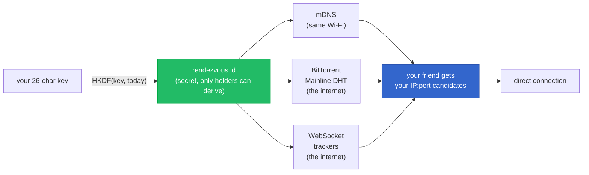
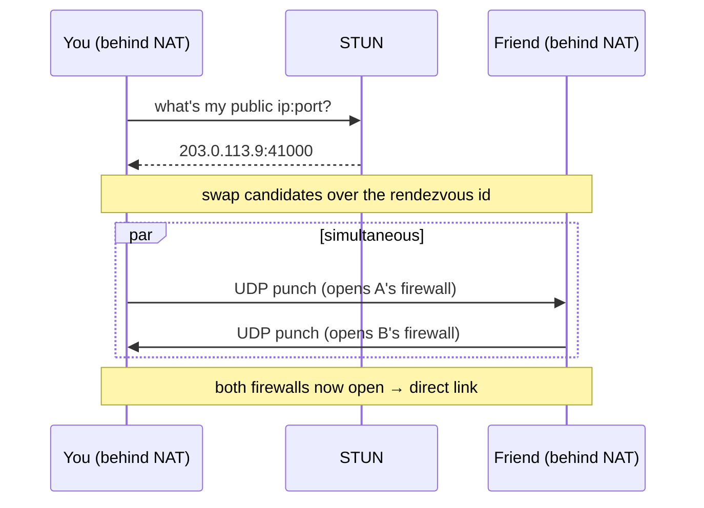
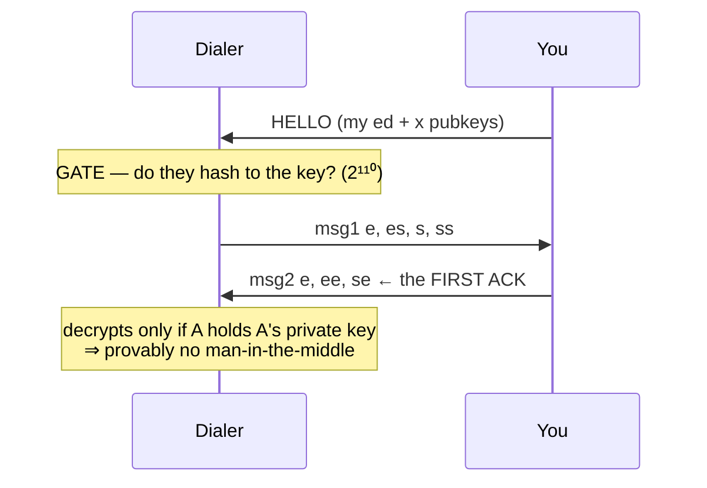

# p2p

> Tiny, zero-dependency P2P chat framework. One 26-char key is your whole contact
> surface — copy it to a friend, they find you and message you: direct, E2E-encrypted,
> **provably MITM-proof on first contact**, through NAT, with **no coordinator server of
> ours**. Embed it as the messaging backbone of any project.

**Status: v0.1 in active build.** See `DESIGN.md` for the full protocol and `docs/` for the
premortem, interfaces, and API. This README fills in as modules land + verify.

## Why

- **Zero dependencies** — Node built-ins only (`node:crypto` gives X25519 + Ed25519 +
  ChaCha20-Poly1305 + HKDF; `dgram`/`net`; native WebSocket). Nothing to audit but us.
- **No server of ours** — rendezvous rides free public infrastructure (LAN mDNS,
  BitTorrent Mainline DHT, public WebSocket trackers); we operate none of it.
- **MITM-proof first contact** — the 26-char key commits to your identity keys; the first
  ack a peer decrypts is a cryptographic proof no man-in-the-middle is present.
- **Small** — the whole thing targets ~2.5–3.5k LOC.

## Quickstart

```js
import { identity, listen } from '@fire17/p2p'

// Machine A
const me = await identity()          // { S: "5J8K…26 chars", ... }  ← share me.S
const node = await listen(me)
node.on('message', (peer, data) => console.log(data.toString()))   // (peer, data)

// Machine B (holds A's key string)
const node = await listen(await identity())
const peer = await node.connect('5J8K…')   // resolves only after the MITM-proof handshake
await peer.send('hey')                        // realtime, ordered, encrypted
```

`identity()` is async and returns `{ S, edPub, edPriv, xPub, xPriv }` — `S` is the 26-char
key string you share. The `message` event is `(peer, data)`. (Or just use the CLI: `p2p`.)

CLI demo: `npx p2p-chat` (generates a key on one machine, `p2p-chat <key>` connects from another).

## How it works — the whole magic

The hard question p2p answers: **how do two computers on different networks find each other
and talk directly, with no server of ours in the middle?** Three ideas stacked.

### 1. Your key is your identity

The 26-char key you share is not random — it's a **fingerprint of your public keys**:

```
 26 Crockford-base32 chars = 130 bits
┌────────────┬───────────────────────────────────┬──────────────┐
│ version 5b │ commitment 110b                   │ checksum 15b │
│            │ = first 110 bits of               │ (catches     │
│ crypto     │   SHA-256(edPubkey ‖ xPubkey)     │  typos       │
│ agility    │   → binds you to your keypairs     │  offline)    │
└────────────┴───────────────────────────────────┴──────────────┘
```

So the string simultaneously **names you** and lets a friend **verify** it's really you —
nobody can mint a string that points at your identity but is secretly theirs (that would
need a second-preimage on 110 bits, ~2¹¹⁰ work).

### 2. Discovery without a server — a shared secret meeting-point on infra that already exists

Both peers hash the key the same way to get an identical **rendezvous id** — a secret
meeting-point only holders can compute (`rid = HKDF(key, epoch)`). Then they leave a note at
that id on **free public infrastructure we don't run** — the note is only ever an opaque hash
+ an IP address, never your identity or messages.



We publish to all three at once and race the reads. **mDNS** covers the same network; the
**BitTorrent DHT** and **WebSocket trackers** are two independent internet paths (millions of
existing nodes / community servers) — we're just guests, using their normal "announce / find"
under our secret id. No coordinator of ours, and no single point of failure.

### 3. NAT traversal — punch a hole, no relay

Now each side knows the other's public IP. Home routers (NAT) drop unexpected packets, so both
peers fire a UDP packet at each other **at the same instant** — the outbound packet props your
own firewall open just long enough for the reply to get in. Both open at once → a direct path.



~70–90% of pairs connect directly (STUN → hole-punch); the ladder falls back IPv6 → LAN →
punch → TCP simultaneous-open → relay-through-a-mutual-peer when a network is stubborn.

### 4. The MITM-proof first contact — the first ack is a cryptographic proof

Once connected, your friend fetches your public keys over the punched path, checks they hash
to the fingerprint **inside your key**, then runs a standard **Noise IK** handshake:



The first message your friend can **decrypt** could only be produced by the holder of your
real private key. An impostor who intercepted everything but lacks it can never produce it —
so `✅ secure channel established — verified, no MITM` is a proof, not a hope. After that it's
a direct, ChaCha20-Poly1305-encrypted UDP link (ordered, retransmitted on loss).

### 5. Every path — staying connected

Keepalives hold the NAT mapping open; if a peer goes silent past a liveness window the node
fires `disconnect`. Reconnecting redials and replays any buffered messages **exactly-once**
(each side carries a per-process instance nonce so a restarted peer's fresh message numbers
aren't mistaken for duplicates). Friends you've connected with are saved to
`~/.p2p/friends.json`, so you can `p2p connect <name>` them again anytime.

### 6. The stack (zero dependencies)

`key` (identity + gate) · `noise` (Noise IK, in-house, KAT-verified) · `wire` (framing +
sliding-window ARQ + keepalive) · `transport` (STUN + ICE-lite punch) · `rendezvous`
(mDNS + DHT + tracker) · `node` (the public API). ~4k LOC, Node built-ins only, `deps: {}`.

## Install

```sh
curl -fsSL https://p2p.akeyo.io/init | sh          # macOS / Linux
irm https://p2p.akeyo.io/init.ps1 | iex            # Windows
```

Then `p2p` for the full-screen chat, or `p2p key` to see your key. Full technical walkthrough
with diagrams: **https://p2p.akeyo.io**

## Security in one paragraph

Your key = `version ‖ 110-bit commitment to (Ed25519, X25519) pubkeys ‖ checksum`, in
Crockford base32. A contacting peer fetches your candidate keys over the rendezvous
channel, gates them against the commitment (2¹¹⁰ second-preimage), then runs a Noise `IK`
handshake — so the very first message it can decrypt proves it's talking to the holder of
your private key, not a relay or a MITM. Rendezvous topics are `HKDF(key, …)`, so channel
operators can't enumerate or read. Full threat model + honest residual risks (session-granular
forward secrecy, TOFU on the initiator direction with a single published key, metadata to
relays): `research/crypto-firstcontact.md` and `DESIGN.md §3`.

## License

MIT.
